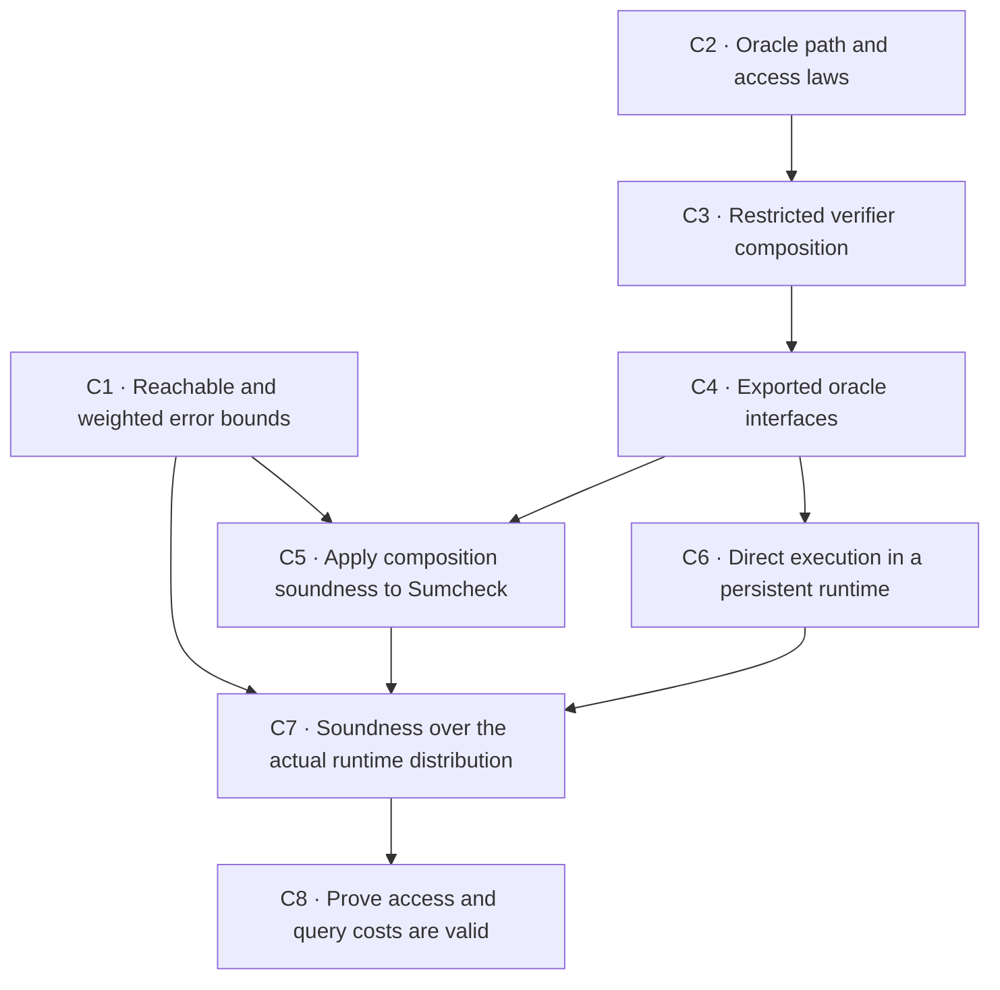

# Interaction framework roadmap

**Status date: 2026-10-03.** This is the implementation roadmap for ArkLib's typed
interaction framework. The [current-status page](00-current-status.md) records available results
and dependency versions. The [project index](../../ROADMAP.md) covers other areas; the
[migration gates](../../roadmap/interaction-migration.md) define readiness to replace legacy clients.

C1–C8 are merged. The two security runs have produced reviewed open PRs for native round-by-round
security, knowledge composition, randomized state restoration, Sumcheck restoration, and terminal
Merkle transfer. Their [first](interaction-security-night-results.md) and
[second](interaction-security-second-night-results.md) run records own exact statements and heads.
The completed contracts below are historical records, not instructions to repeat those runs.

The next integration step is to land the reviewed dependency stack and preserve its proofs.
Further implementation should target the remaining generality and client gaps: early rejection
and variable-length restoration, substantive extraction, native FRI/Spartan correspondence, and
general oracle elimination. The [open-questions note](guarded-restoration-open-questions.md)
records alternatives without adopting an unproved interface.

**Status terms:** *Merged* means on `main`; *proved in an open PR* means checked at the recorded
head but not yet merged; *planned* means no completion claim. The source revision here includes
reviewed open PRs. Do not infer merge status from a file's presence in this integration branch.

## Scope and contracts

Continue from the ordinary paired runner and the native results listed in
[current status](00-current-status.md). Preserve the prover's actual continuation, its private
memory, declared oracle access, and the order of effects. Do not add a second executor or a separate
prover-state machine.

The exact tree, access, closing, and effect-order contracts belong to the
[access and execution contract](01c-access-execution-contract.md) and
[oracle-reduction core](02-oracle-reduction-core.md). Persistent state, the adversary's view,
security events, and fault accounting belong to
[oracle execution and security games](03-adversarial-oracle-execution.md). The first verifier
composition result uses a boundary that returns data and has no pending action. If a protocol needs
an effect at that boundary, represent it as a protocol move or prove the local effect-order law.

For Sumcheck, the final equality between the original polynomial oracle and the claimed value stays
in the output oracle relation; it is not an extra final verifier query.

## Oracle composition sequence (C1–C8)

C1–C8 landed in #1231–#1238. The dependencies below record how the results fit together; the
issues record their implementation PRs and merge status.

### Milestone 1 — Oracle composition and complete Sumcheck (C1–C5)

These five steps prove that restricted oracle protocols compose correctly. They then use the
composition theorems to recover the existing Sumcheck soundness bound and completeness result.
They are the entry point for later protocol clients.

### C1 — Reachable and weighted soundness bounds

**Landed in [PR #1231](https://github.com/Verified-zkEVM/ArkLib/pull/1231).**
Tracked in [issue #1222](https://github.com/Verified-zkEVM/ArkLib/issues/1222).

[`CompositionSoundness.lean`](../../ArkLib/Interaction/CompositionSoundness.lean) now provides
fixed-prover, support, almost-everywhere, and weighted bounds using VCVio's existing measure
semantics. It retains the uniform `ε₁ + ε₂` and `ε₁ + δ + ε₂` interfaces as corollaries.
The exact assumptions belong to [the security chapter](03-adversarial-oracle-execution.md#42-probability-premises-at-the-actual-boundary).

The acceptance client distinguishes two branch-dependent errors, an unreachable boundary, and a
structurally supported response of probability zero. The latter demonstrates why a support premise
is stronger than an almost-everywhere premise. See [current status](00-current-status.md) for the
available declarations. C1 required no dependency changes.

### C2 — Oracle path and access laws

**Landed in [PR #1232](https://github.com/Verified-zkEVM/ArkLib/pull/1232).**
Tracked in [issue #1223](https://github.com/Verified-zkEVM/ArkLib/issues/1223).

The owning modules now connect oracle append to runtime trees and roles, concrete path append and
split, accumulated access, and deterministic query answers. The laws reuse PolyFun's existing
paths and decorations and the existing closing handler. They add no resource representation or
executor. See [current status](00-current-status.md) for their scope.

The acceptance client uses two genuinely different suffix shapes, mixed prover/verifier roles,
and distinct initial, prefix, and suffix oracle answers. This establishes the path and handler
facts used by C3. The C2 path laws alone make no claim about execution by a prover and verifier.

### C3 — Restricted verifier composition

**Landed in [PR #1233](https://github.com/Verified-zkEVM/ArkLib/pull/1233).**
Tracked in [issue #1224](https://github.com/Verified-zkEVM/ArkLib/issues/1224).
C3 uses C2's path and access laws.

`Verifier.Fragment` returns an ordinary leaf value; `Verifier.Strategy` retains the completed
form with a final oracle action. Both use the same recursive interpreter.
[`Sequential.lean`](../../ArkLib/Interaction/Oracle/Sequential.lean) provides `Verifier.append`
and `executeStrategies_append`. The theorem splits every whole native prover at the actual
boundary, preserving its remaining strategy, private output, oracle resources, and effect order.
Its exact constraints belong to [the composition contract](02-oracle-reduction-core.md#5-composition).

The acceptance client checks private memory, challenge and abort responses, both possible owners
of the first suffix move, and one final action. An effect-order counterexample shows why moving a
pending prefix action across the next send is outside this theorem's scope.

### C4 — Exported oracle interfaces and closing

**Tracked in:** [issue #1225](https://github.com/Verified-zkEVM/ArkLib/issues/1225).

**Merged:** [PR #1234](https://github.com/Verified-zkEVM/ArkLib/pull/1234).

**Depends on:** C2 and C3.

[`SourceRouting.lean`](../../ArkLib/Interaction/Oracle/SourceRouting.lean) connects verifier
composition to virtual oracle substitution and claim closing. `Verifier.appendExported` takes a
prefix returning a statement and an exported oracle interface. The suffix receives that statement
and is written against only that interface; each new oracle message adds its own query slot.
`executeStrategies_appendExported_close` proves agreement with sequential execution using the
actual prefix resources and the actual remaining prover strategy. Closing the final claim uses
those same resources. The [composition contract](02-oracle-reduction-core.md#54-virtual-substitution-and-routing)
records the precise scope and restrictions.

**Acceptance check:** Export an oracle that combines or transforms source answers and hides another
source slot. Run the two Sumcheck rounds through the composed interface. Preserve the actual
prover continuation and challenge/abort behavior. One exported query may expand to several source
queries, so do not require the two query logs to be identical.

### C5 — Apply soundness composition to Sumcheck

**Implemented in [PR #1235](https://github.com/Verified-zkEVM/ArkLib/pull/1235).** Tracked in
[issue #1226](https://github.com/Verified-zkEVM/ArkLib/issues/1226).
C5 uses C1 and C4.

[`Oracle/CompositionSoundness.lean`](../../ArkLib/Interaction/Oracle/CompositionSoundness.lean)
proves uniform and weighted bounds for the actual composed oracle execution. It separately charges
true intermediate claims, false claims outside the suffix assumptions, and success from false
admissible claims. A true intermediate claim is not charged twice. The suffix event includes the
final verifier action and closing under the actual resources.

[`Sumcheck/Interaction/Composition.lean`](../../ArkLib/ProofSystem/Sumcheck/Interaction/Composition.lean)
identifies the existing native execution with its first round followed by the remaining rounds.
The soundness proof now applies the general oracle bound to recover `count * deg / |F|`, retaining
the original theorem statement and its arbitrary whole native prover. Honest full-protocol
completeness follows through the same composed execution. Support truth holds for any ambient
challenge program; probability-one completeness uses normalized `ProbComp` execution. The final
polynomial equality remains in the output oracle relation.

The oracle probability client checks a derived exported oracle, a random final decision, separate
truth and input-assumption errors, and a supported branch of probability zero. The native clients
check adaptive two-round execution and the original challenge/abort effect order. Current
constraints belong to [the security chapter](03-adversarial-oracle-execution.md#42-probability-premises-at-the-actual-boundary).

### Milestone 2 — Persistent runtime composition (C6–C8)

These steps connect the oracle-composition theorems to persistent runtime state, ordered logs, and
resource accounting. They preserve correlations with the prover's actual view without revealing
hidden runtime state to the prover. The native runner remains the execution engine.

### C6 — Direct execution in a persistent runtime

**Implemented in [PR #1236](https://github.com/Verified-zkEVM/ArkLib/pull/1236).** Tracked in
[issue #1227](https://github.com/Verified-zkEVM/ArkLib/issues/1227).
C6 uses C4 and reuses VCVio's existing runtime.

The direct native-strategy entry points now cover logged, phased, and persistent-runtime
execution. Reduction setup remains inside the same initialized runtime, including any ambient
queries it makes. Erasure recovers ordinary core execution with the actual final state. The
phased/logged comparison also preserves the paired source observations and chronological ambient
history. No new interpreter or ArkLib-only state machine is introduced.

The acceptance client checks counter answers `1, 2, 3` across prover setup and both protocol
stages, with final state `3`. A separate actual exported-interface client checks one-to-many source
query expansion, private prover output, and exact source and ambient logs. The generic
`withQueryLog_simulateQ` law compares these logs through the handler's actual query programs.
C7 below adds the probability bound; C8 supplies access and cost certificates.

### C7 — Soundness over the actual runtime distribution

**Tracked in:** [issue #1228](https://github.com/Verified-zkEVM/ArkLib/issues/1228).

**Implemented in [PR #1237](https://github.com/Verified-zkEVM/ArkLib/pull/1237):**
`Oracle/RuntimeSoundness`; acceptance examples in
`ArkLibTest/Interaction/Oracle/RuntimeSoundness`.

**Depends on:** C1, C5, and C6.

`Oracle/RuntimeSoundness` now connects the actual native execution split to one persistent
runtime. Its main theorem bounds final closed-claim success by an exceptional prefix event plus
an average suffix error. The averaging uses the actual joint distribution of runtime state,
prover continuation, intermediate claim, and ambient history.

The client proves that average suffix bound for its runtime. The theorem does not require a bound
at each fixed hidden state, and the whole prover is fixed before runtime initialization. A bound
for almost every fixed full result after the prefix gives a stronger, convenient sufficient
condition. Erasing logs alone does not transfer ordinary oracle soundness to an arbitrary runtime.

The suffix program receives the actual prefix output, including the extracted native continuation.
Runtime resumption supplies hidden state internally. A function called a prover view does not by
itself restrict information: the experiment must show which answers the prover receives before it
chooses a message. Retain the actual state and ordered ambient history in the execution equality.
Keep rejection, explicit returned faults, and missing probability mass distinct. Charge an explicit
fault term only when the theorem's event or model requires it.

**Acceptance:** The native hidden-bit client initializes its secret once. A fixed guess made before
any revealing answer succeeds with probability `1/2`, and the proof applies the main composition
theorem. A matching fixed secret gives success one, ruling out a uniform fixed-secret half bound.
A second fixed whole prover queries the secret before committing and succeeds with probability one;
its averaged half premise is proved false. Both clients retain the actual query history and state.

### C8 — Prove oracle access and query costs are valid

**Tracked in:** [issue #1229](https://github.com/Verified-zkEVM/ArkLib/issues/1229).

**Implementation:** `Oracle/Access`, `Oracle/Prefix`, and `Data/OracleComp/QueryBounds`;
acceptance examples in `ArkLibTest/Interaction/Oracle/QueryBounds` and `RuntimeQueryBounds`.

**Depends on:** C6 and C7.

`Oracle/Prefix` derives available query names from the actual accumulated source signature.
Continuation and append preserve earlier identities and concrete messages. `Data/OracleComp/QueryBounds`
transports allowed-query conditions through the actual route, bounds its weighted query expansion,
and adds sequential budgets. The same received oracle may be queried repeatedly; its name stays
shared and each query still contributes to the cost.

The generic access condition checks all authored queries. Cost bounds cover complete paths, so a
numerical cost certificate alone does not establish availability. The pinned cost layer uses small
query/response types and natural-number costs; the structural prefix laws retain their universes.
No independent stages, normalized probability distribution or nonempty answer types are needed for
these generic laws.

**Acceptance:** The actual phased two-send run supplies the join and terminal prefixes used by
its source-resource certificates. It retains a shared old oracle, expands one virtual query into
two old calls, then reads a fresh oracle. Its weighted bound is five, and a completed execution
rules out budget four. The fresh resource fails access at the actual join for every cost budget.
Ambient phase logs and source-query logs remain distinct.

The second client imports C7's same hidden-bit experiment and half-bound theorem. It proves actual
export provenance, source access, a routed suffix budget of five, a whole-runtime imported-query
budget of one, and actual ambient history charges four and seven for the guessing and informed
provers. The latter still succeeds surely. Certificates accompany the fixed-prover security proof;
they do not turn a numerical budget into a soundness theorem for arbitrary adversaries.
Arbitrary world-query classifiers still require a separate proof connecting labels to resources.

## Native Sumcheck: delivered results and remaining migration

The full native ordinary-soundness and honest-completeness theorems are proved. The computational and security work below has since advanced in the reviewed integration.
Distinguish the delivered statements from efficiency, substantive extraction, and migration obligations.

1. **Computable messages and verifier, merged in #1242.** Bounded CompPoly coefficient arrays
   and Horner evaluation are used in the native protocol. Whole-execution correspondence and
   soundness transfer are proved in `Interaction/Computable` and `Interaction/ComputableSoundness`.
2. **Computable honest prover, merged in #1243.** `Impl/Projection` constructs messages by general
   finite enumeration. `Interaction/ComputableCompleteness` proves honest execution correspondence
   and completeness. The compiled runtime client executes the computational oracle and strategy;
   this does not establish an efficient multilinear implementation.
3. **Native round-by-round security, proved in open PR #1261.** Actual execution prefixes and
   Sumcheck's per-challenge bound are connected to the full error bound. The theorem retains the
   distinction between an all-prefix certificate and an average over an actual run.
4. **Knowledge and extraction, partially delivered.** General knowledge composition is proved
   in open PR #1260, randomized restoration in #1268, and the Sumcheck restoration instance in
   #1269. Current oracle Sumcheck has a `Unit` witness: its polynomial is already an input oracle.
   Recovery of a hidden polynomial or committed witness needs a different explicit relation,
   extractor and proof. The delivered results do not supply that stronger claim.
5. **Efficient implementations and legacy migration.** Optimize the Boolean multilinear case using
   CompPoly evaluation tables, with proved message/update algorithms and separately stated costs.
   The computable general prover alone makes no efficiency claim. Repair or migrate legacy
   Sumcheck claims with correspondence and axiom checks; do not treat the native result as silently
   proving those old declarations.

## Historical first security run

This overnight work package was recorded on October 2, 2026, broadened after the literature
review. The user approved the revised general-theory contract and explicitly launched the run
on October 3 at 00:56:52 America/New_York. It does not adopt a replacement architecture. The
[Chiesa-Yogev comparison](../kb/audits/chiesa-yogev-interaction.md) records source versions,
evidence, the larger pipeline and unresolved alternatives. The long-term requirement is to
recover the textbook's results in our language and generality, ideally across the whole book.
The [broader source map](../kb/audits/interaction-literature-map.md) additionally anchors
knowledge transport in WARP/ABF26 and keeps Funky, duplex-sponge FS, FICS/FACS, compositional
zero knowledge and post-quantum IORs in scope. The textbook is not the sole conformance target.

The purpose of this run is to resolve a few precise questions with checked mathematics, while
leaving broader choices open. The intended morning result is reusable local-to-global soundness, knowledge-composition and
state-restoration security theorems, with exact scope and any incomplete targets stated honestly.
The entire compiler and knowledge hierarchy remain longer-term goals. The run has an eight-hour limit ending at 08:56:52 America/New_York.
Estimates do not promise that a mathematical target will be achieved.

### October 3 authorized run

The research commits through `c3e715d23` are pushed on `research/cy-interaction-theory`.
The user explicitly launched the revised general-theory goal at 00:56:52 America/New_York
(04:56:52Z), with deadline 08:56:52 (12:56:52Z). The six-hour checkpoint is 06:56:52;
expansion freezes at 07:26:52 to reserve final review and consolidation. The earlier premature
launch was stopped without implementation changes and does not consume this window.
See the [run record](interaction-security-night-results.md) for exact work/check/PR evidence.

The [accepted mathematical contract](interaction-security-night-contract.md) states the actual
definitions, theorem statements, MUST/SHOULD/HOPE boundaries and unresolved choices. It fixes the mathematical target; literal Lean interfaces still require statement review. That document governs the revised priorities. The earlier deferral of aggregate ordinary
soundness and full SR is superseded by G1-G3; small examples are validation aids.

The revised objective is general theory: round-by-round security implies full ordinary soundness;
round-by-round knowledge certificates compose sequentially; and round-by-round knowledge soundness
implies state-restoration knowledge soundness with the source-faithful (Q+k) error bound.
These replace the earlier example-centered minimum. Proposed PR order: research/contract notes,
then the general ordinary theorem with Sumcheck, general knowledge composition, and the SR theorem.
Examples support validation and do not count as the primary mathematical achievements. Aim for roughly
500-1500 changed lines per substantial PR; a smaller important self-contained result is also fine.
Keep internal worker checkpoints separate from publication boundaries. The main orchestrator owns
strict review under review-lean-formalization, including clear terminology for a cryptographic
audience. The contract gives the exact review gates and naming requirements. No empty scaffolding
PR, no merge into main, and no claim that a deterministic lemma already proves SR security.

Prepared worktrees are `ArkLib-interaction-night`, `ArkLib-local-rbr`,
`ArkLib-witness-transport`, and `ArkLib-interaction-review`, all from
`ace55c3e29da1fc55a321378ada55ea4f7ed8790`. They isolate the active implementation and review work.
The pinned VCVio/PolyFun and Lean 4.34.0 remain unchanged. Shared dependency builds must be
serialized; code branches stay separate from documentation history.

The accepted contract is the single source for the definitions, statements, MUST/SHOULD/HOPE
priorities, PR boundaries and stopping rules. The earlier local-lemma and toy-example decomposition
is preserved in research-branch history, not repeated here as a competing implementation plan.
At handoff, update the run record with literal theorem statements, exact commits, validation and
review evidence, and every unresolved target. No worker may turn a supported-fragment restriction
into an unstated permanent limitation of the framework.

## Later protocol clients

FRI and Spartan are the next protocol migration candidates. The general Sumcheck computational
and fixed-round security results now provide a starting point. Each client still needs its own
execution correspondence and explicit security obligations; the remaining research questions
are not automatically prerequisites for every port.

- **FRI slice:** use a derived virtual oracle view and prove a two-way bridge to the established
  presentation.
- **Spartan-like slice:** use a fresh prover message and prove the corresponding two-way bridge.
- **Broader migration:** port existing FRI and Spartan clients one at a time; develop BCS and
  IVC protocols as separate constructions where no legacy implementation exists. Keep the
  legacy security namespace until each migrated protocol has its own proved correspondence.

For each slice, record the exact statement, oracle interface, prover information, success event,
and error bound. A protocol's use of the generic API is evidence for that client; it does not
automatically prove every legacy equivalence.

## Later extraction and compiler work

### State restoration and knowledge composition

Knowledge composition and fixed-round state restoration are now proved in the reviewed PRs
listed above, including interleaved private randomness and expected fresh-query charges.
The remaining question is how to extend them to the next client while preserving extractor
access, timing, witness relations, rejection behavior, and actual query costs.

Do not require a generic causal transducer as a prerequisite for the already completed theorems.
Add a new upstream abstraction only for a concrete unproved client obligation. General guarded
restoration and substantive witness recovery remain open; plain terminal knowledge soundness
does not by itself yield prefix-available extraction.

### Oracle-elimination compiler

Build the compiler only after the ordinary security, runtime, query-trace, and extraction results
needed by its passes exist. Follow the interfaces and pass order in
[04-oracle-elimination-compiler.md](04-oracle-elimination-compiler.md): represent ideal oracle
guarantees, assign backends, plan reads, lower and transport claims, then prove concrete Merkle and
homomorphic adapters. Carry soundness, extraction, privacy, query costs, and running time through
each pass. Do not fill unsupported backend capabilities with placeholder guarantees.

### AR-11 — Merkle adapter

**Proved in open PRs #1270 and #1271.** Native terminal commitment/opening protocols now
transfer acceptance to an ideal extracted-value verifier using VCVio's existing shared-ROM
security theorem. The second result allows bounded answer-dependent query choices. Both receive
openings in a terminal batch, and neither supplies the independent ideal soundness premise.

General online opening protocols and the full BCS, Fiat–Shamir, and oracle-elimination compiler
remain planned. See [Merkle ownership](../../roadmap/interaction-migration.md#merkle-ownership)
for the repository boundary and [second-run results](interaction-security-second-night-results.md)
for the exact restrictions and resource bounds.

## Conditional upstream work

Use upstream PolyFun or VCVio only for a demonstrated client need. VCVio's runtime and
failure-to-return support are already available. The missing generic trace transducer, certified
query-log bridge, reusable conditioning, or error-bearing reduction API should be added at its
owning repository when an ArkLib proof needs that exact capability. Operational
`DynSystem.Prefix` concatenation is needed only if a client cannot use ordinary monadic sequencing.
Any temporary adapter must name the upstream destination, have a deletion condition, and disappear
when the upstream API lands.

If a real protocol needs an effect at an intermediate boundary, first express it at an explicit
interaction node. If that cannot preserve the protocol, prove the local effect-order law or propose
the smallest coherent PolyFun extension. If a suffix tree needs a dependency not represented by
the interaction's public choices, document that client and propose the needed upstream change. Do
not assume global effect commutativity and do not create a second ArkLib executor to work around
either limitation.

## Delivery rules

- Give each implementation PR one main theorem or API as its focus. Include the laws, acceptance
  examples, and documentation needed to use that result.
- Begin the next step while the current PR runs validation or CI, using isolated build outputs.
  Merge in dependency order after validation and independent review. After a dependency merges,
  bring the next PR onto the updated `main` and verify that the change was preserved.
- Reuse a supported upstream API before adding another wrapper or executor. Put reusable additions
  in the library that owns them; remove temporary ArkLib adapters when the upstream API lands.
- Use a real protocol or security theorem to test each foundational API. Keep the legacy namespace
  until each migrated protocol has a proved correspondence.
- Keep dependency bumps separate from theorem changes. Add no new `sorry` and run the repository's
  required validation before commit.
- Update [00-current-status.md](00-current-status.md) when a reviewed capability changes,
  distinguishing merged results from exact open-PR heads.

Use names and docstrings that a cryptographer can understand without knowing the internal Lean
representation. State who chooses the prover, what the verifier observes, which event is bounded,
and how the error depends on the assumptions. Have an independent reviewer explain the principal
theorem in those terms and compare it with the intended game. Treat a failed proof as evidence about
the theorem or its assumptions, not as a reason to hide a stronger claim behind a weaker name.

## Completed second security run

The [second eight-hour contract](interaction-security-next-night-contract.md) fixes the
mathematical statements, MUST/SHOULD/HOPE priorities, PR order, review gates, and open
questions. The run began at 17:34:15 UTC with an October 4, 01:34:15 UTC deadline,
and completed its contracted work before that limit. Exact completion and consolidation
evidence is in the run record.
Both MUSTs are now proved and independently reviewed: VCVio's arbitrary-domain expected
distinct-query bound and ArkLib's actual cached randomized restoration knowledge bounds.
The native terminal-batch Merkle transfer and ordinary Sumcheck restoration application are
also proved, reviewed, and fully validated. See the [run evidence](interaction-security-second-night-results.md)
for exact revisions, dependency pins, source restrictions, and substantial PRs.

The accepted restoration fragment retains fixed rounds, finite message/challenge alphabets,
explicit endpoint relation laws, and the existing named extractor. The Merkle transfer uses
raw-digest vectors, immutable commitment-time extraction, and terminal batch verification;
it supplies a restricted AR-11 capability, not the general oracle-elimination compiler.
Sumcheck proves ordinary soundness with the native aborting output correspondence.

The [causal terminal query-program extension](adaptive-terminal-query-contract.md) has also
passed its proofs, full validation, and independent review. It supplies recursive path
agreement and a clean ideal program whose terminal-opening phase can be erased. The
[fixed-initial-cache query extension](initial-cache-query-contract.md) has also passed full
validation and independent review. Its arbitrary-domain bound charges only distinct keys
absent from the fixed initial cache and retains the explicit same-run fresh bad-key witness.

The [early-rejection research note](guarded-restoration-open-questions.md) records the next
generic-adapter obligations without selecting unresolved interfaces. The other open questions
in the eight-hour contract remain open.
